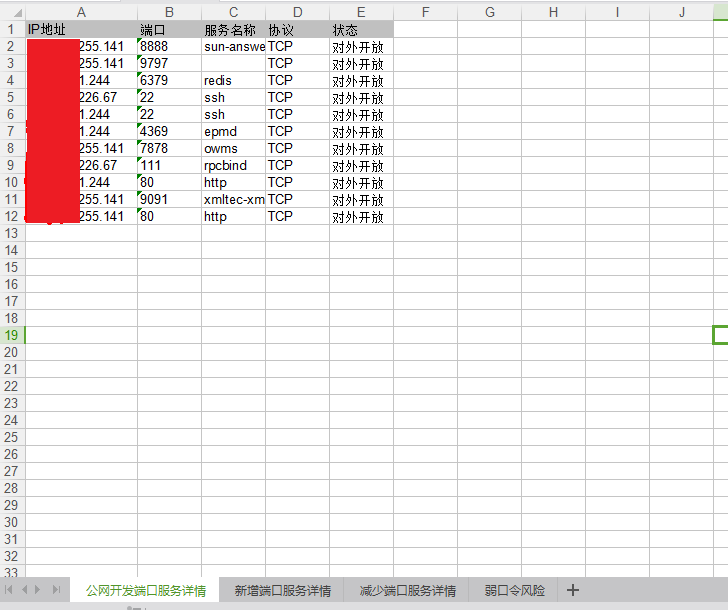
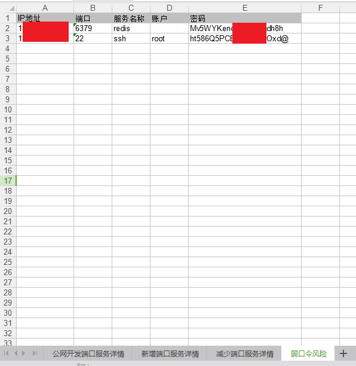
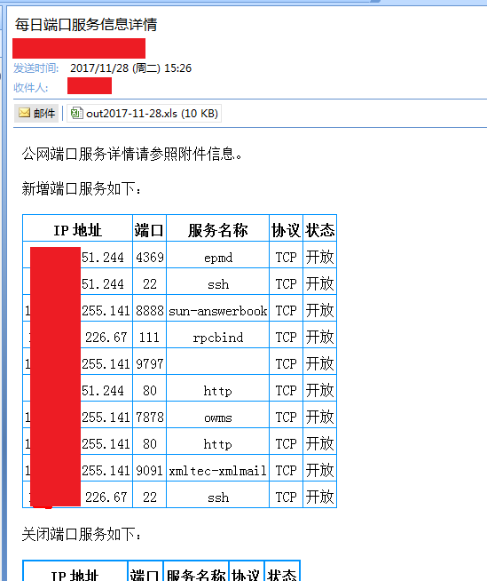

# PublicMonitors 0.1

这个脚本的主要目标是以甲方安全人员的视角，对IP列表进行定时端口服务扫描，及时发现对外违规开放服务和存在风险的服务端口，并生成excel结果，进行邮件通知。

## Author ##

原作者：咚咚呛。https://github.com/grayddq/PublicMonitors.git

我在此基础上修改了邮件乱码，邮件端口，多IP发送有问题等。

## Support ##

满足如下安全需求

	1、对列表IP进行快速全端口扫描
	2、周期时间(如每日)增加/减少哪些些端口服务
	3、开放的端口服务是否存在弱口令风险
	4、输出所有结果到excel，并发送Email通知

技术细节如下：

	1、调用Masscan进行快速扫描
	2、调用Nmap进行端口服务名称判断
	3、以IP+端口+服务名称为标准，与上一次的结果向比较，判断增加和减少服务
	4、为防止漏报，减少的服务进行二次nmap扫描，判断是否漏扫
	5、针对结果进行弱口令扫描
	6、发送所有结果到email

## Test Environment ##

>CentOS Linux release 7.3.1611 (Core)

>python 2.7

## Dependencies ##
> sudo yum install nmap
>
> sudo yum install hydra (hydra v8.0+ 版支持redis服务)
> 
> yum install git gcc make libpcap-devel.x86_64
> 
> wget https://github.com/robertdavidgraham/masscan/archive/1.0.4.tar.gz
> 
> tar -zxvf 1.0.4.tar.gz
> 
> cd masscan-1.0.4/
> 
> make
>
> cp bin/masscan /bin/masscan
>
> git clone https://github.com/xiaozhiqi2000/PublicMonitors.git
> 
> sudo pip install -U pip
>
> sudo pip install -r requirements.txt

## Tree ##

	PubilcAssetInfo
	----conf   #配置目录
	----lib    #模块库文件
	----log    #日志目录
	----out    #输出目录
	----tmp    #临时目录
	----PublicMonitors.py   #主程序
	

## Config ##

配置目录：./conf/info.conf

	[OPTIONS]
	#IP列表文件目录
	ip_file = conf/ip.txt
	#弱口令账户和密码，不填写则代表不进行弱口令扫描。pass.txt默认包含top100密码
	db_user = conf/user.txt
	db_pass = conf/pass.txt
	#扫描类型，monitors / weakpass /all
	#monitors 代表最终不进行弱口令扫描
	#weakpass 针对最后的一次扫描结果进行弱口令扫描
	#all      代表端口监听后进行弱口令扫描
	type = all
	
	[Masscan]
	#Masscan扫描器的发包数量，越大越快但漏扫量越多，1M～=2000，
	rate = 2000
	
	[Email]
	#不填写则代表不发送邮箱通知
	#发送的邮箱账户和密码
	user = 
	pass = 
	#目标邮箱
	target_email = 
	#smtp的server名称，如163邮箱则填写smtp.163.com
	smtp_server = 
        smtp_port = 25

## Log ##

日志目录默认：./conf/info.conf

## Screenshot ##

## output ##

输出目录默认：./out/

## email ##

